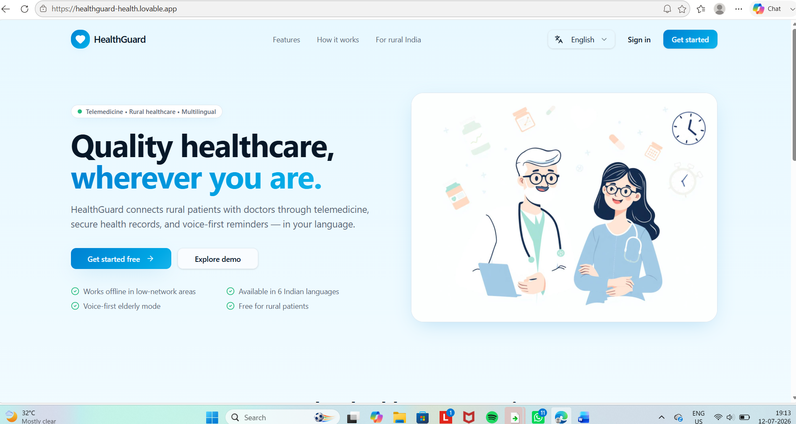
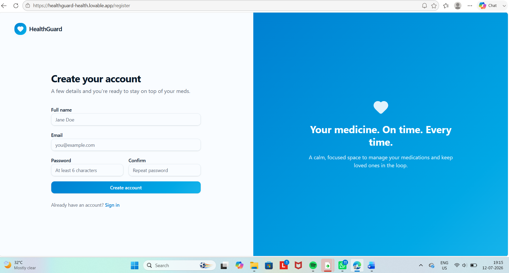
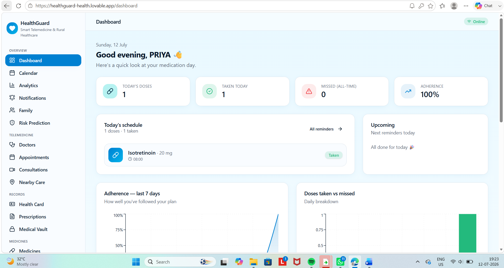
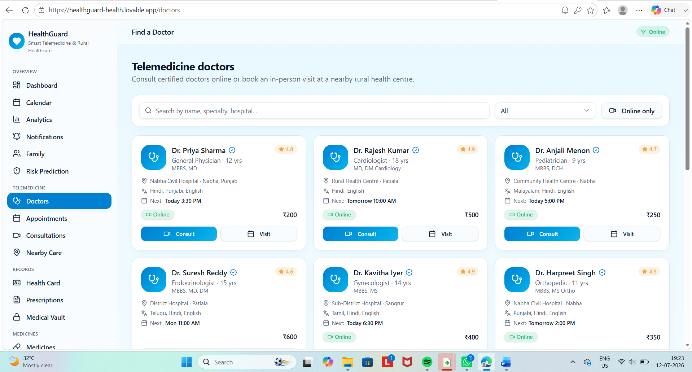
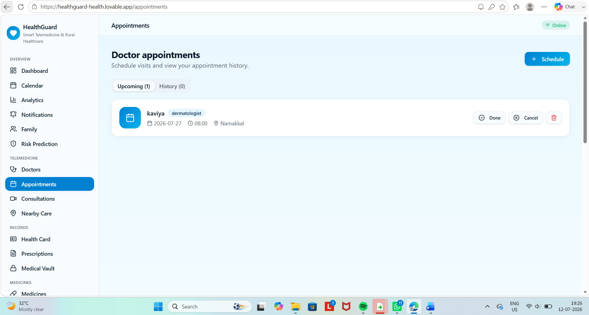
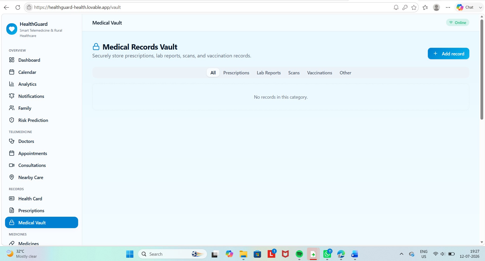
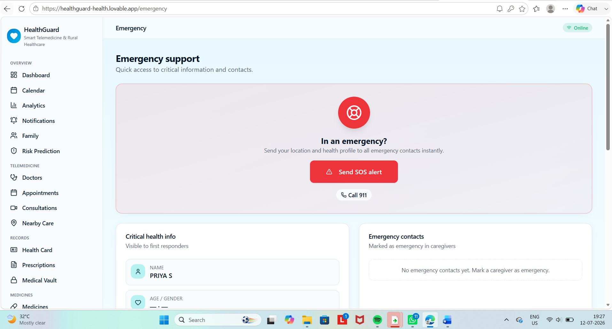

# 🏥 HealthGuard

HealthGuard is a smart telemedicine and rural healthcare management system designed to improve healthcare accessibility, especially for rural communities. The platform enables patients and healthcare providers to efficiently manage appointments, digital health records, symptom tracking, emergency support, and healthcare services through a secure and user-friendly web application.

---

## 🚀 Features

### 👨‍⚕️ Patient Module
- Patient Registration
- Secure Login & Authentication
- Patient Dashboard
- Appointment Booking
- Appointment History
- Symptom Tracking
- Digital Health Record Management
- Profile Management

### 🩺 Doctor Module
- Doctor Login
- Doctor Dashboard
- Appointment Management
- Patient Health Record Access
- Prescription Management

### 🚑 Emergency Services
- Emergency SOS Support
- Nearby Hospital Information
- Emergency Contact Assistance

### 📋 Healthcare Management
- Digital Medical Records
- Health History Tracking
- Secure Patient Data Storage
- Real-Time Healthcare Management

### 🔐 Security
- User Authentication using Supabase
- Secure Cloud Database
- Protected User Data

### 📱 User Experience
- Responsive Web Interface
- Easy-to-Use Navigation
- Real-Time Data Synchronization
- Mobile-Friendly Design

---

## 🛠 Tech Stack

### Frontend
- React.js
- TypeScript
- HTML5
- CSS3

### Backend & Database
- Supabase
- PostgreSQL

### Development Tools
- Git
- GitHub
- Visual Studio Code
- Lovable AI

### Authentication
- Supabase Authentication

---

---

# 📸 Screenshots

## 🏠 Home Page

---

## 🔐 Login Page

---

## 👨‍⚕️ Patient Dashboard

---

## 🩺 Doctor Dashboard

---

## 📅 Appointment Booking

---

## 📋 Health Records

---

## 🚑 Emergency Support

